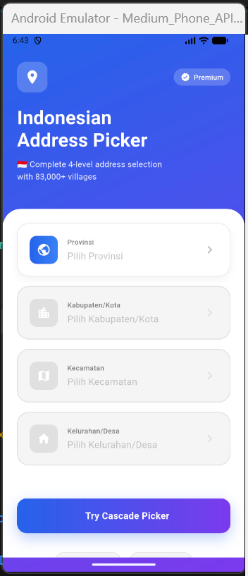

# Indonesian Address Picker

[](https://pub.dev/packages/indonesian_address_picker)
[](https://opensource.org/licenses/MIT)
[](https://flutter.dev)

**The most complete and modern Indonesian address picker for Flutter.** Select from 34 provinces, 514+ cities, 7,000+ districts, and 83,000+ villages with a beautiful, searchable UI that works 100% offline.

Perfect for e-commerce, delivery apps, forms, and any application requiring Indonesian address input.

---

## Features

### Complete Data Coverage
- **34 Provinces** (Provinsi)
- **514+ Cities** (Kabupaten/Kota)
- **7,000+ Districts** (Kecamatan)
- **83,000+ Villages** (Kelurahan/Desa)

### Beautiful UI/UX
- Modern, premium design with gradient cards
- Smooth animations and transitions
- Responsive layout for all screen sizes
- Dark mode compatible

### Smart Search
- Real-time search across all levels
- Case-insensitive matching
- Fuzzy search support
- Fast performance even with large datasets

### Offline-First Architecture
- All data embedded in the package
- No internet connection required
- Zero API calls = faster performance
- Works in airplane mode

### Developer-Friendly
- Simple, intuitive API
- Comprehensive documentation
- TypeScript-like type safety
- Well-tested with unit tests
- Easy to customize and extend

### Production-Ready
- Thoroughly tested
- Optimized for performance
- Memory efficient with caching
- No external dependencies (except Flutter SDK)

---

## Screenshots

<p float="left">
  
  
</p>

---

## Quick Start

### Installation

Add to your `pubspec.yaml`:
```yaml
dependencies:
  indonesian_address_picker: ^0.1.0
```

Then run:
```bash
flutter pub get
```

### Basic Usage
```dart
import 'package:indonesian_address_picker/indonesian_address_picker.dart';

// Show province picker
showModalBottomSheet(
  context: context,
  builder: (context) => ProvincePicker(
    onSelected: (province) {
      print('Selected: ${province.name}');
    },
  ),
);
```

---

## Usage Examples

### 1. Province Picker

Select from 34 Indonesian provinces:
```dart
import 'package:flutter/material.dart';
import 'package:indonesian_address_picker/indonesian_address_picker.dart';

void showProvinceSelection(BuildContext context) {
  showModalBottomSheet(
    context: context,
    isScrollControlled: true,
    builder: (context) => SizedBox(
      height: MediaQuery.of(context).size.height * 0.75,
      child: ProvincePicker(
        searchHint: 'Cari provinsi...',
        onSelected: (province) {
          print('Province ID: ${province.id}');
          print('Province Name: ${province.name}');
        },
      ),
    ),
  );
}
```

### 2. City Picker (Filtered by Province)

Select cities within a specific province:
```dart
CityPicker(
  provinceId: '32', // Jawa Barat
  searchHint: 'Cari kota...',
  onSelected: (city) {
    print('City: ${city.name}');
    print('Province ID: ${city.provinceId}');
  },
)
```

### 3. District Picker

Select districts (kecamatan) within a city:
```dart
DistrictPicker(
  cityId: '3273', // Kota Bandung
  searchHint: 'Cari kecamatan...',
  onSelected: (district) {
    print('District: ${district.name}');
  },
)
```

### 4. Village Picker

Select villages/sub-districts (kelurahan/desa):
```dart
VillagePicker(
  districtId: '3273010', // Example district
  searchHint: 'Cari kelurahan...',
  onSelected: (village) {
    print('Village: ${village.name}');
  },
)
```

### 5. Cascade Address Picker (All-in-One)

The easiest way to get complete address selection:
```dart
import 'package:flutter/material.dart';
import 'package:indonesian_address_picker/indonesian_address_picker.dart';

class AddressFormPage extends StatelessWidget {
  @override
  Widget build(BuildContext context) {
    return Scaffold(
      appBar: AppBar(title: Text('Select Address')),
      body: CascadeAddressPicker(
        onComplete: (province, city, district, village) {
          // All selections completed
          print('Complete Address:');
          print('Province: ${province.name}');
          print('City: ${city.name}');
          print('District: ${district?.name ?? '-'}');
          print('Village: ${village?.name ?? '-'}');
          
          // Save to your form or database
          _saveAddress(province, city, district, village);
        },
      ),
    );
  }
  
  void _saveAddress(Province province, City city, District? district, Village? village) {
    // Your save logic here
  }
}
```

### 6. Using AddressService Directly

For advanced use cases, access data programmatically:
```dart
import 'package:indonesian_address_picker/indonesian_address_picker.dart';

// Get all provinces
final provinces = await AddressService.getProvinces();
print('Total provinces: ${provinces.length}');

// Search provinces
final javaProvinces = await AddressService.searchProvinces('jawa');
print('Found ${javaProvinces.length} provinces containing "jawa"');

// Get cities by province ID
final cities = await AddressService.getCitiesByProvince('32');
print('Cities in Jawa Barat: ${cities.length}');

// Get districts by city ID
final districts = await AddressService.getDistrictsByCity('3273');
print('Districts in Bandung: ${districts.length}');

// Get villages by district ID
final villages = await AddressService.getVillagesByDistrict('3273010');
print('Villages: ${villages.length}');

// Get specific province by ID
final province = await AddressService.getProvinceById('32');
if (province != null) {
  print('Province: ${province.name}');
}

// Search with filters
final searchResults = await AddressService.searchCities(
  'bandung',
  provinceId: '32', // Optional: filter by province
);
```

---

## Customization

### Custom Search Decoration
```dart
ProvincePicker(
  searchHint: 'Type province name...',
  searchDecoration: InputDecoration(
    hintText: 'Search here...',
    prefixIcon: Icon(Icons.search, color: Colors.blue),
    border: OutlineInputBorder(
      borderRadius: BorderRadius.circular(25),
    ),
    filled: true,
    fillColor: Colors.grey[100],
  ),
  onSelected: (province) {
    // Handle selection
  },
)
```

### Styling Bottom Sheet
```dart
showModalBottomSheet(
  context: context,
  isScrollControlled: true,
  backgroundColor: Colors.transparent,
  builder: (context) => Container(
    height: MediaQuery.of(context).size.height * 0.85,
    decoration: BoxDecoration(
      color: Theme.of(context).colorScheme.surface,
      borderRadius: BorderRadius.vertical(top: Radius.circular(25)),
    ),
    child: ProvincePicker(
      onSelected: (province) {
        // Handle selection
      },
    ),
  ),
);
```

---

## Data Models

### Province Model
```dart
class Province {
  final String id;        // e.g., "32"
  final String name;      // e.g., "JAWA BARAT"
}
```

### City Model
```dart
class City {
  final String id;           // e.g., "3273"
  final String provinceId;   // e.g., "32"
  final String name;         // e.g., "KOTA BANDUNG"
}
```

### District Model
```dart
class District {
  final String id;       // e.g., "3273010"
  final String cityId;   // e.g., "3273"
  final String name;     // e.g., "BANDUNG KULON"
}
```

### Village Model
```dart
class Village {
  final String id;           // e.g., "3273010001"
  final String districtId;   // e.g., "3273010"
  final String name;         // e.g., "CIJERAH"
}
```

---

## Advanced Usage

### Caching & Performance

The package automatically caches loaded data for optimal performance:
```dart
// First call: loads from JSON (slower)
final provinces1 = await AddressService.getProvinces();

// Subsequent calls: uses cache (instant)
final provinces2 = await AddressService.getProvinces();

// Clear cache if needed (rarely necessary)
AddressService.clearCache();
```

### Error Handling
```dart
try {
  final provinces = await AddressService.getProvinces();
  // Use provinces
} catch (e) {
  print('Error loading provinces: $e');
  // Show error message to user
}
```

### Validation
```dart
// Check if province exists
final province = await AddressService.getProvinceById('32');
if (province == null) {
  print('Province not found');
}

// Validate city belongs to province
final city = await AddressService.getCityById('3273');
if (city != null && city.provinceId == selectedProvince.id) {
  print('Valid city for selected province');
}
```

---

## Testing

The package includes comprehensive unit tests. To run tests:
```bash
flutter test
```

Example test:
```dart
import 'package:flutter_test/flutter_test.dart';
import 'package:indonesian_address_picker/indonesian_address_picker.dart';

void main() {
  TestWidgetsFlutterBinding.ensureInitialized();

  test('Load provinces successfully', () async {
    final provinces = await AddressService.getProvinces();
    expect(provinces, isNotEmpty);
    expect(provinces.length, greaterThanOrEqualTo(30));
  });

  test('Search provinces works', () async {
    final results = await AddressService.searchProvinces('jawa');
    expect(results, isNotEmpty);
    expect(results.every((p) => p.name.toLowerCase().contains('jawa')), isTrue);
  });
}
```

---

## What's Included

- **4 Picker Widgets**: Province, City, District, Village
- **1 Cascade Picker**: All-in-one solution
- **AddressService**: Programmatic data access
- **4 Data Models**: Type-safe models
- **Complete Dataset**: 83,000+ locations
- **Search Functionality**: Built-in filtering
- **Example App**: Full working demo
- **Unit Tests**: Comprehensive test coverage

---

## Use Cases

Perfect for:
- **E-commerce apps** - Shipping address input
- **Delivery apps** - Location selection
- **Forms & Surveys** - Address collection
- **Business apps** - Branch/office location
- **Property apps** - Real estate listings
- **Healthcare apps** - Patient address
- **Education apps** - Student information
- **Any app requiring Indonesian addresses**

---

## Package Stats

- **Size**: ~5MB (includes all data)
- **Data accuracy**: Based on official government sources
- **Last updated**: December 2024
- **Maintenance**: Actively maintained
- **Flutter support**: 3.0.0+
- **Platform support**: iOS, Android, Web, Desktop

---

## Contributing

Contributions are welcome! Here's how you can help:

1. **Report Bugs**: Open an issue on GitHub
2. **Suggest Features**: Share your ideas
3. **Submit PRs**: Fix bugs or add features
4. **Update Data**: Help keep regional data current
5. **Improve Docs**: Better documentation helps everyone

### Development Setup
```bash
# Clone the repository
git clone https://github.com/donisettt/indonesian_address_picker.git

# Install dependencies
cd indonesian_address_picker
flutter pub get

# Run tests
flutter test

# Run example app
cd example
flutter run
```

---

## Data Source & Accuracy

This package uses Indonesian administrative division data from:
- **Source**: [api-wilayah-indonesia](https://github.com/emsifa/api-wilayah-indonesia) by @emsifa
- **Based on**: Official data from Kemendagri (Ministry of Home Affairs)
- **Data snapshot**: December 2024
- **Update frequency**: We aim to update data semi-annually

### Data Accuracy Notice

Regional divisions in Indonesia can change due to:
- New provinces/cities (pemekaran wilayah)
- Name changes
- Administrative reorganization

For critical applications, we recommend:
- Verifying against official government sources
- Implementing a data update mechanism
- Allowing manual address input as fallback

---

## Example Apps Built With This Package

Using this package in your app? Let us know! We'd love to feature it here.

---

## Tips & Best Practices

### 1. Optimize Bottom Sheet Height
```dart
// Use 70-85% of screen height for better UX
height: MediaQuery.of(context).size.height * 0.75
```

### 2. Handle Back Navigation
```dart
ProvincePicker(
  onSelected: (province) {
    // Automatically closes bottom sheet
    Navigator.pop(context);
    // Then handle your logic
    setState(() => selectedProvince = province);
  },
)
```

### 3. Save IDs, Display Names
```dart
// Save IDs to database (stable)
database.save(provinceId: province.id);

// Display names to users (readable)
Text(province.name);
```

### 4. Provide Clear Visual Feedback
```dart
// Show what's selected
if (selectedProvince != null) {
  Text('Selected: ${selectedProvince!.name}');
}
```

### 5. Allow Users to Change Selection
```dart
// Make it easy to re-select
ListTile(
  title: Text(selectedProvince?.name ?? 'Select Province'),
  trailing: Icon(Icons.edit),
  onTap: () => showProvincePicker(),
)
```

---

## Known Issues

Currently no known issues. If you find one, please [report it](https://github.com/YOUR_USERNAME/indonesian_address_picker/issues).

---

## Roadmap

### v0.2.0 (Q1 2025)
- [ ] Postal code (kode pos) data integration
- [ ] Dark mode optimizations
- [ ] Additional customization options
- [ ] Improved search algorithm

### v0.3.0 (Q2 2025)
- [ ] Optional API integration for real-time updates
- [ ] Coordinate data (latitude/longitude)
- [ ] Export/import custom datasets
- [ ] Multi-language support (EN/ID)

### v1.0.0 (Q3 2025)
- [ ] Production-ready stable release
- [ ] Video tutorials
- [ ] Interactive documentation website
- [ ] Performance optimizations

---

## FAQ

**Q: Does this work offline?**  
A: Yes! 100% offline. All data is embedded in the package.

**Q: How large is the package?**  
A: Approximately 5MB including all 83,000+ locations.

**Q: Can I use only provinces and cities?**  
A: Absolutely! Use only the pickers you need.

**Q: How often is data updated?**  
A: We aim for semi-annual updates. Check CHANGELOG for update history.

**Q: Can I customize the UI?**  
A: Yes! The package provides customization options for colors, text, and behavior.

**Q: Does it support Flutter Web?**  
A: Yes! Works on iOS, Android, Web, and Desktop.

**Q: Is it production-ready?**  
A: Yes! Thoroughly tested and used in production apps.

**Q: How do I report incorrect data?**  
A: Open an issue on GitHub with details about the incorrect data.

---

## Support

- **Email**: donisetiawanwahyono@gmail.com
- **Issues**: [GitHub Issues](https://github.com/donisettt/indonesian_address_picker/issues)
- **Discussions**: [GitHub Discussions](https://github.com/donisettt/indonesian_address_picker/discussions)
- **Documentation**: [pub.dev](https://pub.dev/packages/indonesian_address_picker)

---

## Acknowledgments

- Data source: [api-wilayah-indonesia](https://github.com/emsifa/api-wilayah-indonesia) by @emsifa
- Inspired by the needs of Indonesian Flutter developers
- Built with ❤️ for the Flutter community

---

## Show Your Support

If you find this package useful, please:
- Star this repo on [GitHub](https://github.com/donisettt/indonesian_address_picker)
- Like it on [pub.dev](https://pub.dev/packages/indonesian_address_picker)
- Share it on Twitter with #FlutterDev #IndonesianAddressPicker
- Write a blog post about your experience

Your support helps keep this project maintained and improved!

---

<p align="center">
  <strong>Made with ❤️ Doni Sw</strong>
</p>

<p align="center">
  <a href="https://pub.dev/packages/indonesian_address_picker">pub.dev</a> •
  <a href="https://github.com/donisettt/indonesian_address_picker">GitHub</a> •
  <a href="https://github.com/donisettt/indonesian_address_picker/issues">Report Bug</a> •
  <a href="https://github.com/donisettt/indonesian_address_picker/issues">Request Feature</a>
</p>